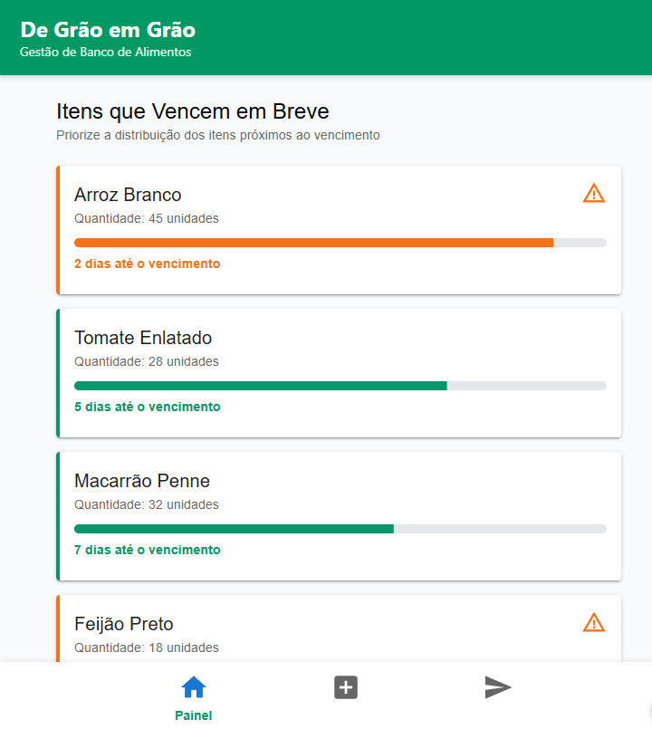
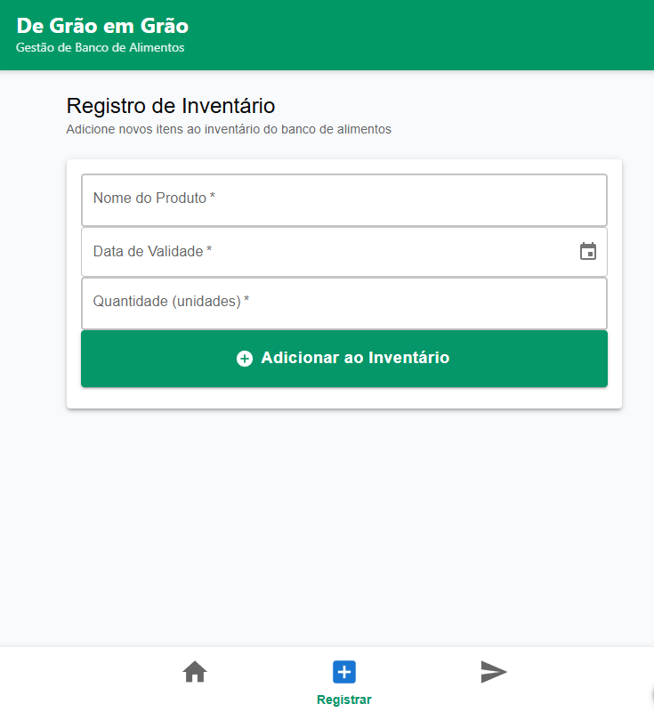
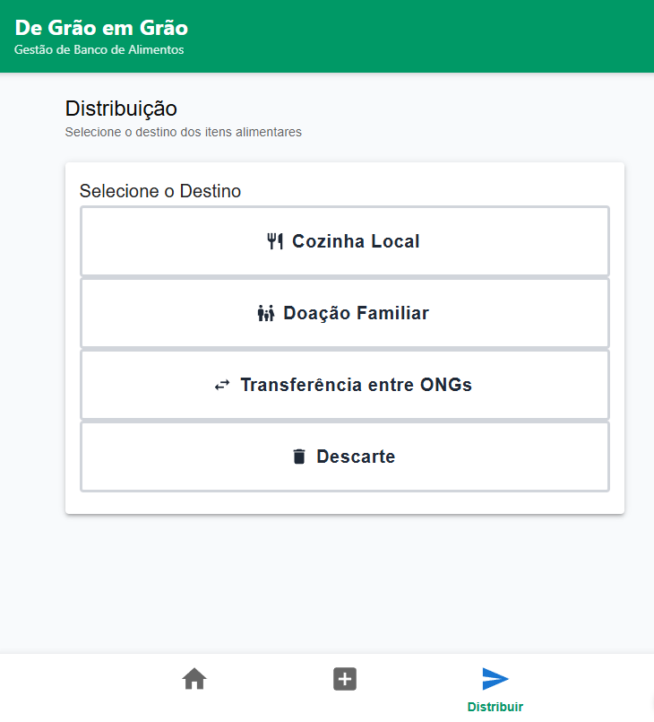

# De Grão em Grão - Sistema de Gestão de Banco de Alimentos 🌾🛒

O **De Grão em Grão** é um sistema de gestão projetado para otimizar o fluxo de armazenamento e distribuição de bancos de alimentos. O foco principal do aplicativo móvel (com suporte web) é garantir uma interface limpa, de alta legibilidade e com grandes áreas de toque, facilitando o trabalho diário de voluntários na triagem e distribuição rápida de alimentos próximos ao vencimento.

---

## 🎨 O Design da Interface (Protótipo)

O design foi construído seguindo as diretrizes do **Material Design 3**, utilizando cores de alto contraste para garantir acessibilidade e fácil operação em ambientes dinâmicos.

* **Verde Esmeralda (`#009661`):** Identidade principal e fluxos seguros.
* **Laranja Alerta (`#f36c13`):** Destaque para itens críticos (vencimento próximo).

### 📸 Capturas de Tela (Figma)

| Painel Principal (Dashboard) | Registro de Inventário | Tela de Distribuição |
| :---: | :---: | :---: |
|  |  |  |

> 🔗 **Link do Protótipo Interativo:** [Acesse o Figma do Projeto](https://bell-rating-80594126.figma.site/)

---

## 🚀 Funcionalidades Atuais (Front-end)

- [x] **Painel Geral (Dashboard):** Visualização de cards com barras de progresso indicando o nível de urgência dos itens que vencem em breve.
- [x] **Registro de Inventário:** Formulário estruturado para entrada de novos produtos com seletor de data nativo.
- [x] **Módulo de Distribuição:** Botões de ação rápida para destinar alimentos para *Cozinha Local*, *Doação Familiar*, *Transferência entre ONGs* ou *Descarte*.
- [x] **Navegação Facilitada:** Barra de navegação inferior persistente com amplas áreas de clique (Touch Targets) para uso ágil no celular.

---

## 🛠️ Tecnologias e Ferramentas Utilizadas

### Front-end (UI/UX)
* **HTML5** (Estruturação semântica)
* **CSS3** (Estilização responsiva com Flexbox/Grid)
* **Figma** (Prototipagem de alta fidelidade)
* **Material Icons** (Biblioteca de ícones do Google)

### Back-end & Banco de Dados *(Em Desenvolvimento)*
* **Java** (Regras de negócio e integração)
* **SQL / Banco de Dados** (Persistência e modelagem dos dados)

---

## 📁 Estrutura do Repositório

├── assets/            # Imagens e capturas de tela do README
├── css/               # Arquivo de estilização global (style.css)
├── index.html         # Tela do Dashboard (Painel)
├── inventario.html    # Tela de formulário de registro
├── distribuicao.html  # Tela de destino e triagem
└── README.md          # Documentação do projeto